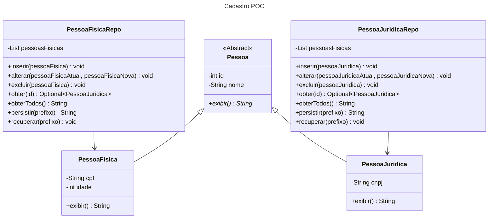

# Cadastro utilizando Programação Orientada a Objetos com persistência de dados em arquivos binários

- Essa missão prática foi dividida em dois procedimentos. 
- O 1ª Procedimento envolve a Criação das Entidades e Sistema de Persistência, enquanto que o 2ª Procedimento envolve a Criação do Cadastro em Modo Texto. O desenvolvimento dos procedimentos estão organizados por branch. 
- O 1ª Procedimento está na branch PrimeiroProcedimento, e o 2ª Procedimento está na branch SegundoProcedimento.
- Essa branch **main** se refere a um resumo dos dois procedimentos. Para visualizar as informações mais detalhadas, mude para a branch do procedimento desejado.

## Objetivos da prática
1. Utilizar herança e polimorfismo na  definição de entidades.
2. Utilizar persistência de objetos em arquivos binários.
3. Implementar uma interface cadastral em modo texto.
4. Utilizar o controle de exceções da plataforma Java.
5. Implementar um sistema cadastral em Java,
utilizando os recursos da programação orientada a objetos e a persistência em
arquivos binários.

## Tecnologias utilizadas

## Diagrama de classes

