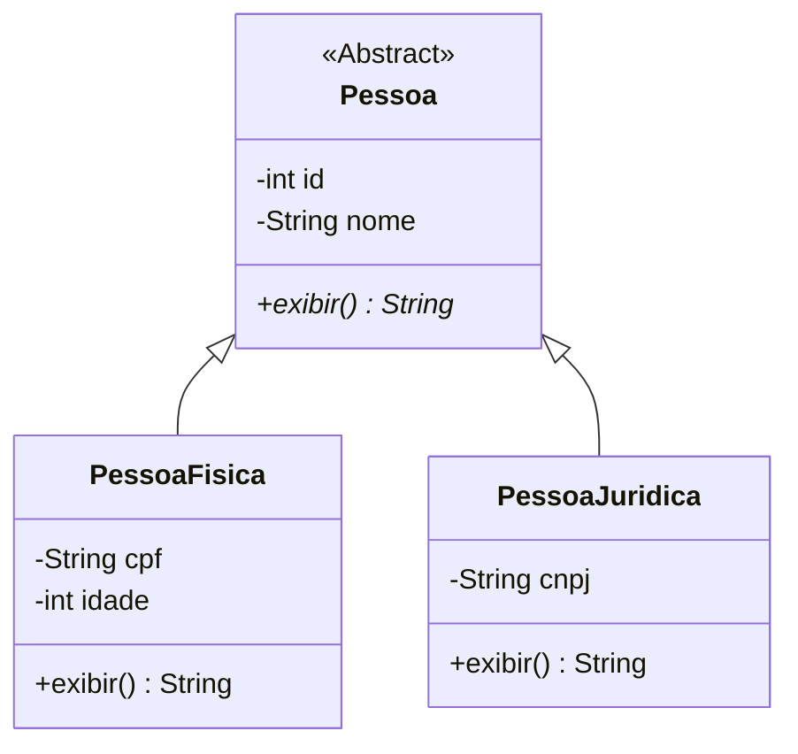

# 1ª Procedimento
## Criação das Entidades e Sistema de Persistência
❕Essa branch se refere somente ao 1ª Procedimento.

## Objetivos desse procedimento
1. Utilizar herança e polimorfismo na  definição de entidades.
2. Utilizar persistência de objetos em arquivos binários.
3. Utilizar o controle de exceções da plataforma Java.

## Tecnologias utilizadas

## Diagrama das classes

